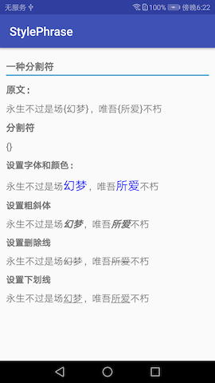
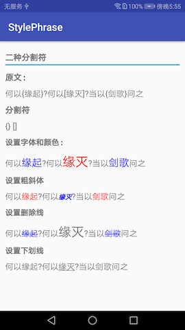
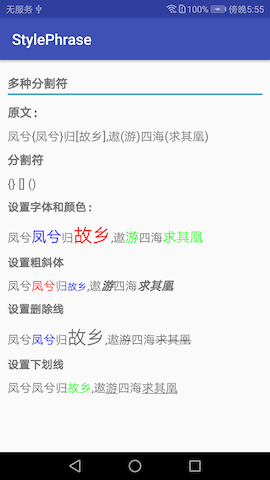
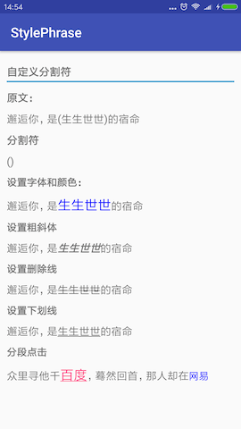

# StylePhrase - Android string formatting

StylePhrase is an Android string resource templating library

在项目中，我们经常会碰到一行文本，部分文字要显示不同的颜色和大小，或者其他样式。使用`StylePhrase`可以很方便的解决这个问题。只需要把需要显示其它样式的文本使用分割符包裹一下，就可以对文本进行各种操作。

本库主要基于以下项目做了修改，更方便使用和扩展：

https://github.com/square/phrase

https://github.com/THEONE10211024/ColorPhrase

# Preview

  

  

# Usage

**注意：对于比较特殊的字符，使用StylePhrase会导致一些问题，尽量使用{}、[]和()作为分割符**

大部分时候，一行文本我们需要显示2种或3种样式，所以`StylePhrase`默认提供两种分割符`{}`和`[]`，当然你也可以修改默认的分割符。为了方便使用，`StylePhrase`默认提供了`setInnerFirstColor`、`setInnerFirstSize`、`setInnerSecondColor`、`setInnerSecondSize`

一种操作符

```kotlin
// 永生不过是场{幻梦}，唯吾{所爱}不朽
val oneSeparatorString = getString(R.string.text_phrase_one)
val colorAndSize = StylePhrase(oneSeparatorString)
                .setInnerFirstColor(Color.BLUE)
                .setInnerFirstSize(20)
tv_content.text = colorAndSize.format()
```

二种操作符

```kotlin
// 何以{缘起}?何以[缘灭]?当以{剑歌}问之
val twoSeparatorString = getString(R.string.text_phrase_two)
val colorAndSize = StylePhrase(twoSeparatorString)
                .setInnerFirstColor(Color.BLUE)
                .setInnerFirstSize(20)
                .setInnerSecondColor(Color.RED)
                .setInnerSecondSize(25)
tv_content.text = colorAndSize.format()
```

多种操作符

```kotlin
// 凤兮{凤兮}归[故乡],遨(游)四海(求其凰)
val colorAndSize = StylePhrase(multiSeparatorString)
                .setInnerFirstColor(Color.BLUE)
                .setInnerFirstSize(20)
                .setInnerSecondColor(Color.RED)
                .setInnerSecondSize(25)
val builder = StylePhrase.Builder()
builder.separator = "()"
builder.setColor(Color.GREEN)
builder.setSize(18)
colorAndSize.addBuilder(builder)
tv_content.text = colorAndSize.format()
```

更多操作可以参考DEMO

# Download

使用`Gradle`进行引用

1.在你根目录的`build.gradle`文件添加代码: `maven { url 'https://www.jitpack.io' }`

```groovy
allprojects {
    repositories {
        ...
        maven { url 'https://www.jitpack.io' }
    }
}
```

2.在你的工程目录添加

`StylePhrase`依赖`appcompat-v7`，所以需要同时引用`appcompat-v7`包

```groovy
dependencies {
	implementation 'com.github.yzbzz:StylePhrase:1.0.3'
    implementation 'com.android.support:appcompat-v7:$version'
}
```

你也可以直接下载`StylePhrase`类放到你的工程中